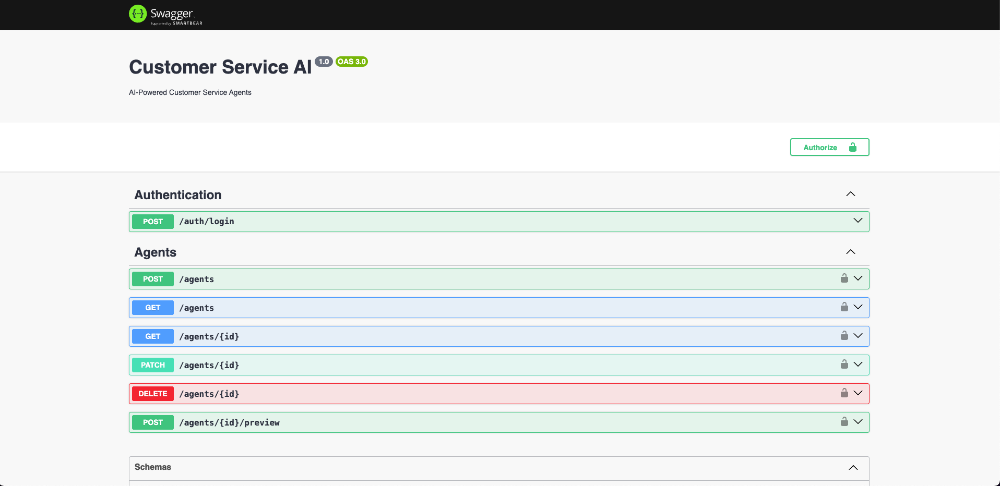

## Description

AI-Powered Customer Service Agents



## Project setup

```bash
# install dependencies
npm install

# seed the database
npm run db:seed
```

## Compile and run the project

```bash
# development
npm run start

# watch mode
npm run start:dev

# production mode
npm run start:prod
```

## Run tests

```bash
# unit tests
npm run test

# e2e tests
npm run test:e2e

# test coverage
npm run test:cov
```
